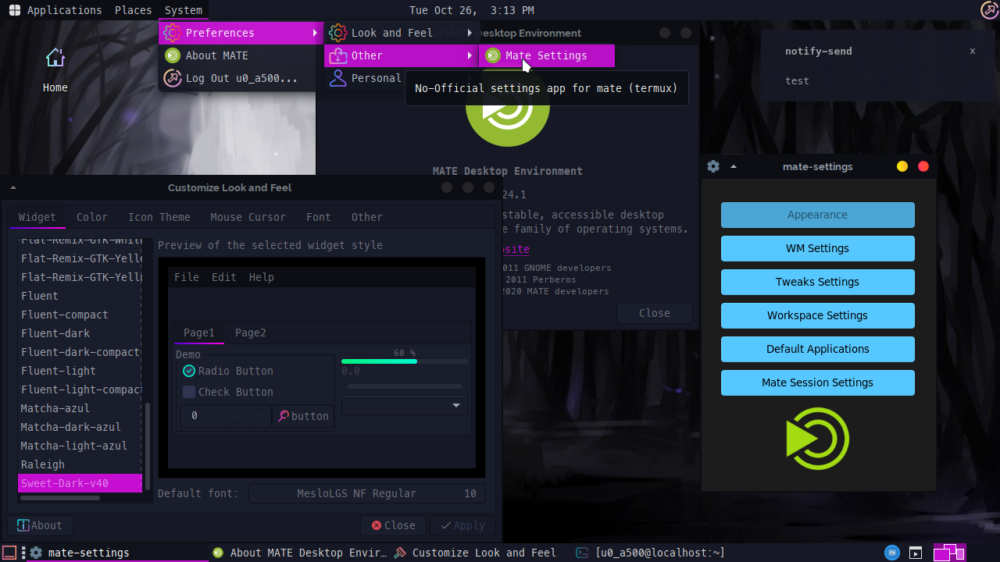

# tmsd
tmsd (termux-mate-settings-daemon) It is a configuration daemon (unofficial) for the Mate desktop environment in termux



## Features

- Change themes, cursors, icons and fonts. 
- Change WM theme
- Edit autostart apps 
- Edit tweaks settings (compositor) 
- Edit workspace settings 
- Edit default applications

## Components used

- Notification daemon: lxqt-notificationd
- Settings daemon: tmsd (use other apps to work)
- Desktop service: xfdesktop
- Window manager: xfwm4

## GUI settings App 

- Use python and tkinter backend

# Notes 
 
Even though xfwm4 is used, for some reason the optimization is still hight.

When changing a gtk or font theme, you must restart the vnc section or server (close and reopen it) for your changes to be successfully uploaded.

# Installation

**Install dependencies :**

```bash
pkg update && pkg upgrade
pkg install clang python-tkinter qt5ct xfdesktop xfce4-settings xfwm4 mate-*

# Recommend (for fine work) 

apt purge marco
```

**And install tmsd:**

```bash
git clone --depth 1 https://github.com/Yisus7u7/tmsd.git
cd tmsd
make install
```

# How to use? 


