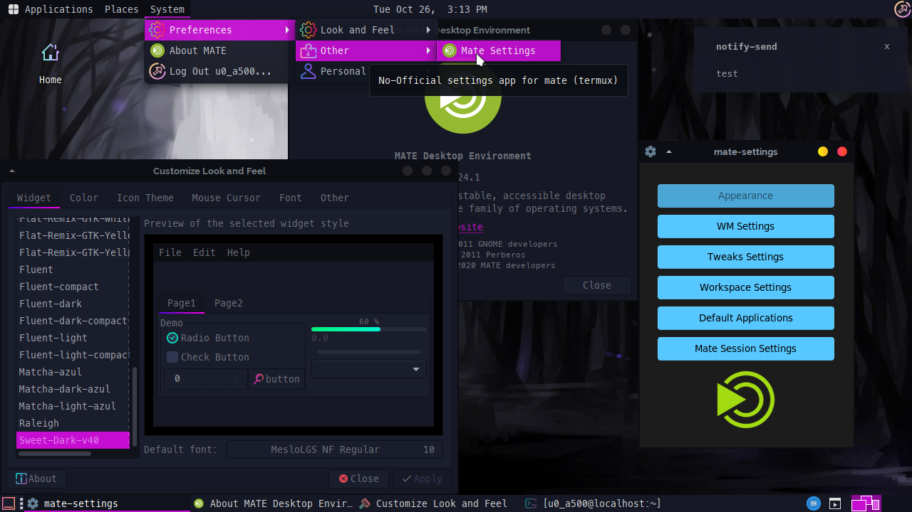
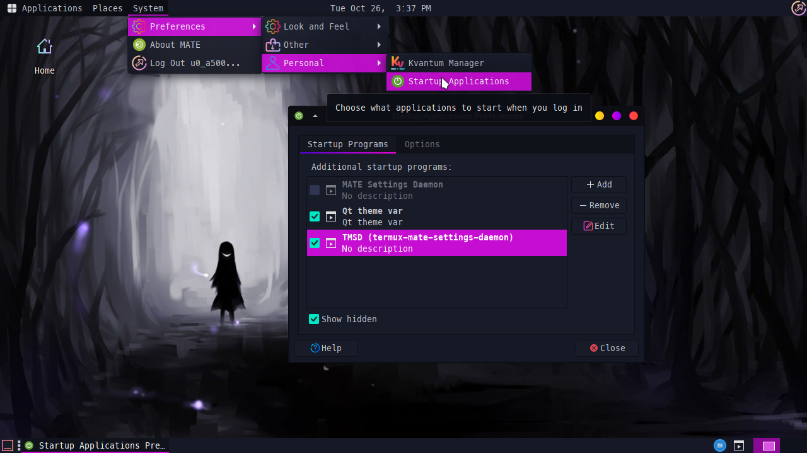

# tmsd
tmsd (termux-mate-settings-daemon) It is a configuration daemon (unofficial) for the Mate desktop environment in termux



## Features

- Change themes, cursors, icons and fonts. 
- Change WM theme
- Edit autostart apps 
- Edit tweaks settings (compositor) 
- Edit workspace settings 
- Edit default applications

## Components used

- Notification daemon: lxqt-notificationd
- Settings daemon: tmsd (using other apps to work)
- Desktop service: xfdesktop
- Window manager: xfwm4

## GUI settings App 

- Using python and tkinter backend

# Notes 
 
Even though xfwm4 is used, for some reason the optimization is still hight, has a very good performance.

When changing a gtk or font theme, you must restart the vnc section or server (close and reopen it) for your changes to be successfully uploaded.

> Remember that this is only a temporary solution while termux manages to compile all the matte components, which may take a long time. 

# Installation

**Install dependencies :**

```bash
pkg update && pkg upgrade
pkg install lxappearance libxtst clang make python-tkinter qt5ct xfdesktop xfce4-settings xfwm4 mate-*

# Recommend (for fine work) 

apt purge marco
```

**And install tmsd:**

```bash
git clone --depth 1 https://github.com/Yisus7u7/tmsd.git
cd tmsd
make install
```

Then add to the file `~/.vnc/xstartup` The following :

`mate-session &`

# How to use? 

Go to System > Personal > Default applications 



Check the "Show hidden" option and disable mate-settings-daemon, 
Then activate the tmsd option (termux-mate-settings-daemon) 

Or in any startup file put a line that says :

`tmsd &`

And voila, restart mate and then you can change themes, fonts, and enjoy your desktop! 

# Contribute 

If you want to improve the project make an extraction request to be reviewed. 

# Credits

- All the development of this project was created by me @Yisus7u7

- Configuration app theme (tkinter) created by [rdbende](https://github.com/rdbende/Sun-Valley-ttk-theme) 

# Help 

Any bug or suggestion can be reported [here](https://github.com/Yisus7u7/tmsd/issues) 

# Donate 

If you want to support the development of this project 
You can donate [here](https://www.paypal.me/JesúsChapman) will be appreciated.

# Contact 

You can contact me at my telegram :

https://t.me/Yisus7u7v

Don't forget to share this with your friends 😎
